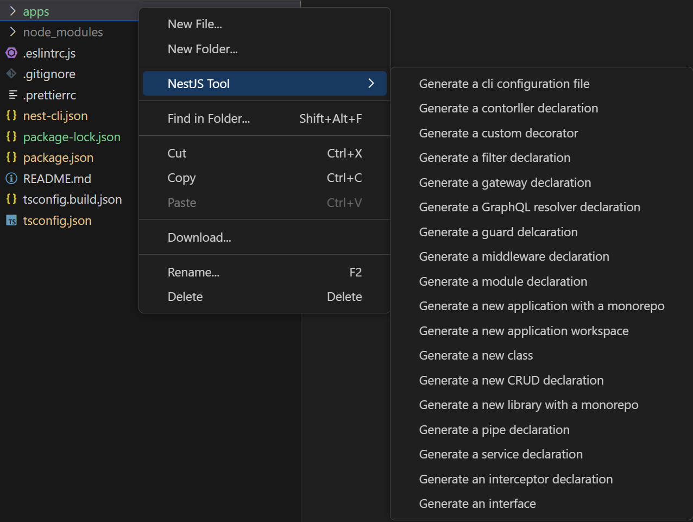

# NestJS Tool

## Overview

NestJS Tool is a tool to help you generate NestJS controllers, modules, services, exceptions, middlewares, pipes, interceptors, decorators, guards, exception filters, unit tests and more.

## Features

Right click on any folder/file in your current project. You can find multiple options that has been added to the context menu:

> It will also automatically add your created files to app module or your own module depending on the context

## Installation

1. Install Visual Studio Code 1.82.0 or higher
2. Launch Code
3. From the command palette `Ctrl`-`Shift`-`P` (Windows, Linux) or `Cmd`-`Shift`-`P` (OSX)
4. Select `Install Extension`
5. Type `NestJSTool` and press enter
6. Install

# License

MIT
